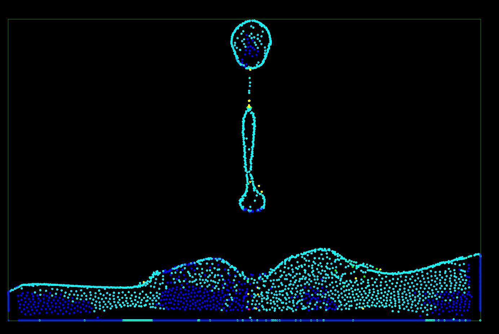

# OpenGL Fluid Simulation 

In this project I familiarized myself with fluid simulation and optimization techniques for perfomance, such as reducing the number of particle collisions by using grids, where particles are being compared to against only their neighbors, and hashmaps for instant memory accesses. The heavy part of the simulation is performed on both CPU and GPU highlighting the benefits of an algorithm that is high parallelizable. The colors of the particles change based on the velocity of each particle producing an eye pleasing effect.

#
# Fetures
* ImGui Editor
    * Border Boundaries
    * Fluid Variables
* Mouse interaction
# Media
| Video: OpenGL Fluid Sim |
|:-:|
|[](https://youtu.be/o_MiktU0-7I)


### Build Instructions
<br>
You will need to install **CMake**

```bash
git clone https://github.com/thedarkdarkchocolate/Fluid-Simulation.git

cd Fluid-Simulation
mkdir build
cd build

cmake -DCMAKE_BUILD_TYPE=Release ..
cmake --build . --config Release
```

# References

Inspired by Sebastian Lague: [Coding Adventure: Simulating Fluids](https://www.youtube.com/watch?v=rSKMYc1CQHE)

[Particle-based Viscoelastic Fluid Simulation](http://www.ligum.umontreal.ca/Clavet-2005-PVFS/pvfs.pdf)

